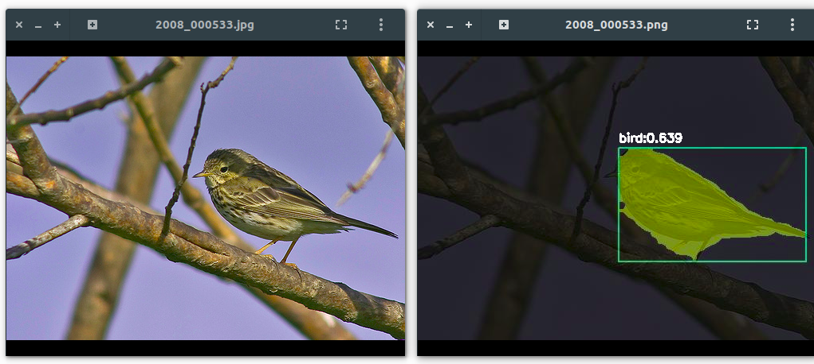
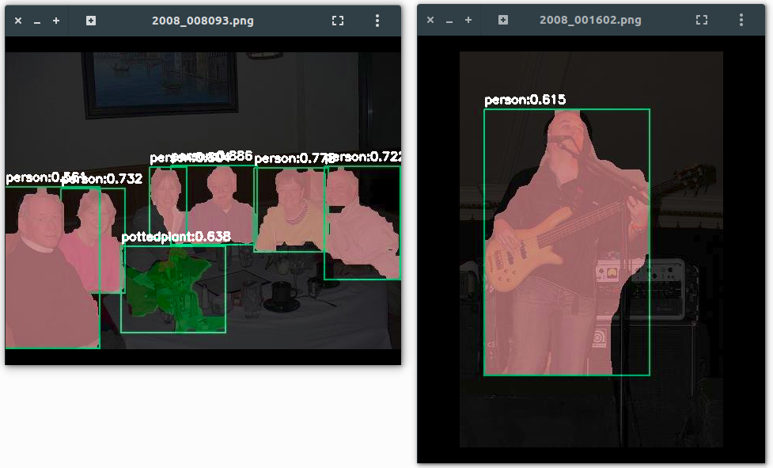

# segm_cfm

Implementation of Convolutional Feature Masking (CFM)

Created by Franck FOTSO

## Introduction:

CFM, which stands for Convolutional Feature Masking. This project is an attempt to implement the segmentation approach [**Convolutional Feature Masking for Joint Object and Stuff Segmentation**](https://arxiv.org/abs/1412.1283)). In the paper, they propose to use the shape information via masking convolutional features. The CNN features are masked out from the convolutional maps and used to train classifiers for recognition. We have setup an end-end framework suitable for data pre-processing, training, test, evalutation and visualization. There are several proposals involved in this project: Selective Search, Multiscale Combinatorial Group ([**MCG**](https://www2.eecs.berkeley.edu/Research/Projects/CS/vision/grouping/mcg/resources/MCG_CVPR2014.pdf)) and Convolutional Oriented Boundaries ([**COB**](http://arxiv.org/abs/1701.04658)).




## Purposes:

Our main goals are:
  * Propose a framework to handle a custom dataset for a segmentation task
  * Propose a framework to handle a range of bounding boxes / segments proposals such as Selective search, MCG or COB.
  * Extract segments & rois from VOC Pascal Segmentation schema (if there is no SBD data).
  * Generate selective search proposals (segments & rois) from images set.
  * Implement a data generator and layers required to load segments/masks in Convolutional Network (AlexNet/ZF/VGG16).
  * Implement key layers involved in CFM approach: ROIPooling & MaskPooling.
  * Perform some post-processing (mask weighing & voting) required for the mask rendering.
  * Test the CFM approach over 4 types of network configs: 
     *  T1 (bbox cls + mask cls)
     *  T2 (bbox cls + mask cls + bbox pred)
     *  T3 (bbox cls + mask cls + bbox pred + mask pred) => our own layers
     *  T4 (bbox cls + mask cls + bbox pred + mask pred) => author's layers (CFM)

## Datasets:

We have used the VOC2012 dataset, parsed as SBD (Semantic Boundaries Dataset). In addition, we also used the MCG and COB proposals related.
Required files are available here:
  * [SBD (VOC2012): train+val (12031 images)](http://www.eecs.berkeley.edu/Research/Projects/CS/vision/grouping/semantic_contours/benchmark.tgz)
  * [SBD (VOC2012): train+val (12031 MCG proposals)](https://data.vision.ee.ethz.ch/jpont/mcg/MCG-SBD-trainval-proposals.tgz)
  * [SBD (VOC2012): train+val (12031 COB proposals)](https://data.vision.ee.ethz.ch/kmaninis/share/COB/Precomputed/COB-SBD-trainval-proposals.tgz)

Those datasets were used to train model over CNN nets: AlexNet, ZF & VGG16. We have explored many CNN nets in the way to see how flexible this approach is. Futhermore, we have provided all prototxt required so that you can test this project in a wide range of Nvidia GPU card ( > 2 Gb)

## Hardwares/Softwares:
    OS: Ubuntu 16.04 64 bit
    GPU: Nvidia GTX 950M 4G
    Cuda 8.0
    CuDNN 3.0.8
    Python 2.7.12
    OpenCV 3.1.0

## Prerequisites:

  1. Caffe (rel. caffe-faster-rcnn & caffe-segm) [prerequisites](http://caffe.berkeleyvision.org/installation.html#prequequisites)
  2. Python's packages (requirements.txt)

## Installation:

To install this project, please follow the steps below:

1. [Install OpenCV](http://www.pyimagesearch.com/2016/10/24/ubuntu-16-04-how-to-install-opencv/)

2. Download the repository:

    ```
    $ cd /opt
    $ sudo git clone --recursive https://github.com/franckfotso/segm_cfm.git
    $ cd segm_cfm
    ```
3. Install all externals repositories required:

    ```
    $ cd /externals/caffe-segm
    ```
    
    Adjust Makefile.config, then
    
    ```
    $ sudo mkdir build
    $ cd build
    $ cmake ..
    $ make -j4
    $ make install
    $ cd ../..
    ```
    
    Install selective_search tool. Prequequisites: [Boost.NumPy](https://github.com/ndarray/Boost.NumPy)
    
    ```
    $ cd /externals/selective_search_py
    $ wget http://cs.brown.edu/~pff/segment/segment.zip; unzip segment.zip; rm segment.zip
    $ mkdir build
    $ cd build
    $ cmake..
    $ make -j 4
    $ cd ../..
    ```
    Note: if you face any troubles, please have a look here [selective_search for python 2.7](https://github.com/franckfotso/selective_search_py)
    
    Install project's libs
    
    ```
    $ cd libs
    $ make
    $ cd ..
    ```
    
4. Install python's packages required:

    ```
    for req in $(cat requirements.txt); do pip install $req; done
    ```
    
Get the data and models required:
1. Download the data and uncompress in '/opt/segm_cfm/data'
  * voc_2012: [PASCAL](http://host.robots.ox.ac.uk/pascal/VOC/voc2012/VOCtrainval_11-May-2012.tar) -> data/voc_2012
  * bsd_voc2012: [BSD](http://www.eecs.berkeley.edu/Research/Projects/CS/vision/grouping/semantic_contours/benchmark.tgz) -> data/bsd_voc2012
  * MCG proposals: [MCG-RAW](https://data.vision.ee.ethz.ch/jpont/mcg/MCG-SBD-trainval-proposals.tgz) -> data/MCG-RAW.init
  * COB proposals: [COB-RAW](https://data.vision.ee.ethz.ch/kmaninis/share/COB/Precomputed/COB-SBD-trainval-proposals.tgz) -> data/COB-RAW.init

2. Download the models and uncompress in '/opt/segm_cfm/data/models'
  * bvlc_alexnet.caffemodel: [Google Drive](https://drive.google.com/open?id=0B_Rjj_NgCayPNU1FZ1VaTWJjQW8)
  * VGG16.v2.caffemodel: [Google Drive](https://drive.google.com/open?id=0B_Rjj_NgCayPa1ZpVEtqSERkNUk)
  * AlexNet_segm_cfm_T3_iter_30000.caffemodel: coming soon
  * AlexNet_segm_cfm_T4_iter_30000.caffemodel: [Google Drive](https://drive.google.com/open?id=0B_Rjj_NgCayPMEQ1ekVJOThLLXM)
  * VGG16_segm_cfm_T3_iter_30000.caffemodel: coming soon
  * VGG16_segm_cfm_T4_iter_30000.caffemodel: [Google Drive](https://drive.google.com/open?id=0B_Rjj_NgCayPUktpWDZYdURaQkk)

## Experiments:

WARNING: Be aware that some commands above are time consuming & high computing.

1. Parse the groundtruth data (from pascal_voc segmentation format):

    ```
    $ cd /opt/segm_cfm
    $ python tools/parse_segm_data.py --dataset voc_2012 \ 
      --gt_set trainval --in_seg_cls data/voc_2012/SegmentationClass \ 
      --in_seg_inst data/voc_2012/SegmentationObject --num_proc 4 \ 
      --out_seg_dir data/sbd_voc2012/SEGM-RAW
    ```
    For help use the command: python tools/parse_segm_data.py --help
    
2. Parse the groundtruth data (from bsd segmentation format):

    ```
    $ cd /opt/segm_cfm
    
    $ python tools/parse_gt_data.py --dataset bsd_voc2012 \ 
      --gt_set train --in_seg_cls data/bsd_voc2012/cls \ 
      --in_seg_inst data/bsd_voc2012/inst --num_proc 4 \ 
      --out_seg_dir data/bsd_voc2012/SEGM-RAW
      
    $ python tools/parse_gt_data.py --dataset bsd_voc2012 \ 
      --gt_set val --in_seg_cls data/bsd_voc2012/cls \ 
      --in_seg_inst data/bsd_voc2012/inst --num_proc 4 \ 
      --out_seg_dir data/bsd_voc2012/SEGM-RAW
    ```
    For help use the command: python tools/parse_gt_data.py --help

3. Parse the proposals so that they can be easily handled by our project:

    ```
    $ cd /opt/segm_cfm
    
    $ python tools/parse_pr_data.py --dataset bsd_voc2012 \
      --gt_set train --in_pr_dir data/bsd_voc2012/MCG-RAW.init \
      --pr_meth mcg --top_k 1000 --num_proc 4 \
      --out_pr_dir data/bsd_voc2012/MCG-RAW.parsed
      
    Let's generate also MCG proposals for demo dataset
      
    $ python tools/parse_pr_data.py --dataset demo \
      --gt_set test --in_pr_dir data/bsd_voc2012/MCG-RAW.init \
      --pr_meth mcg --top_k 1000 --num_proc 4 \
      --out_pr_dir data/demo/MCG-RAW.parsed
    ```
    For help use the command: python tools/parse_pr_data.py --help
    
4. (Optional) Generate 'selective_search' proposals:

    ```
    $ cd /opt/segm_cfm
    
    $ python tools/generate_data.py --dataset bsd_voc2012 \ 
      --gt_set train --pr_meth selective_search --num_proc 4 \ 
      --mode accurate --output_im data/bsd_voc2012/SS-IMG \ 
      --data MASK --output_mat data/bsd_voc2012/SS-RAW
      
    $ python tools/generate_data.py --dataset bsd_voc2012 \ 
      --gt_set train --pr_meth selective_search --num_proc 4 \ 
      --mode accurate --output_im data/bsd_voc2012/SS-IMG \ 
      --data MAT --output_mat data/bsd_voc2012/SS-RAW
      
    Let's do the same for the demo dataset
      
    $ python tools/generate_data.py --dataset demo \ 
      --gt_set test --pr_meth selective_search --num_proc 4 \ 
      --mode accurate --output_im data/demo/SS-IMG \ 
      --data MASK --output_mat data/demo/SS-RAW
      
    $ python tools/generate_data.py --dataset demo \ 
      --gt_set test --pr_meth selective_search --num_proc 4 \ 
      --mode accurate --output_im data/demo/SS-IMG \ 
      --data MAT --output_mat data/demo/SS-RAW
    ```
    For help use the command: python tools/generate_data.py --help

5. Training: bsd_voc2012, AlexNet, selective_search | MCG

    ```
    $ cd /opt/segm_cfm
    
    Using selective_search proposals
    
    $ python tools/train_net.py --gpu_id 0 --dataset bsd_voc2012 \
      --gt_set train --task CFM --solver models/AlexNet/solver_CFM_T{1|2|3|4}.prototxt \
      --weights pretrained/AlexNet/bvlc_alexnet.caffemodel \
      --in_gt_dir data/bsd_voc2012/SEGM-RAW \
      --in_pr_dir data/bsd_voc2012/SS-RAW.parsed \
      --iters 30000 --cache_im_dir cache/bsd_voc2012_train_ss
      
    Using MCG proposals
    
    $ python tools/train_net.py --gpu_id 0 --dataset bsd_voc2012 \
      --gt_set train --task CFM --solver models/AlexNet/solver_CFM_T{1|2|3|4}.prototxt \
      --weights pretrained/AlexNet/bvlc_alexnet.caffemodel \
      --in_gt_dir data/bsd_voc2012/SEGM-RAW \
      --in_pr_dir data/bsd_voc2012/MCG-RAW.parsed \
      --iters 30000 --cache_im_dir cache/bsd_voc2012_train_mcg
    ```
    For help use the command: python tools/train_net.py --help
    
6. Training: bsd_voc2012, VGG16, selective_search | MCG

    ```
    $ cd /opt/segm_cfm
    
    Using selective_search proposals
    
    $ python tools/train_net.py --gpu_id 0 --dataset bsd_voc2012 \
      --gt_set train --task CFM --solver models/VGG16/solver_CFM_T{1|2|3|4}.prototxt \
      --weights pretrained/VGG16/VGG16.v2.caffemodel \
      --in_gt_dir data/bsd_voc2012/SEGM-RAW \
      --in_pr_dir data/bsd_voc2012/MCG-RAW.parsed \
      --iters 30000 --cache_im_dir cache/bsd_voc2012_train_ss
      
    Using MCG proposals
    
    $ python tools/train_net.py --gpu_id 0 --dataset bsd_voc2012 \
      --gt_set train --task CFM --solver models/VGG16/solver_CFM_T{1|2|3|4}.prototxt \
      --weights pretrained/VGG16/VGG16.v2.caffemodel \
      --in_gt_dir data/bsd_voc2012/SEGM-RAW \
      --in_pr_dir data/bsd_voc2012/MCG-RAW.parsed \
      --iters 30000 --cache_im_dir cache/bsd_voc2012_train_mcg
    ```
    For help use the command: python tools/train_net.py --help
    
7. Testing: demo, T4, AlexNet, selective_search | MCG

    ```
    $ cd /opt/segm_cfm
    
    Using selective_search proposals
    
    $ python tools/demo.py --gpu_id 0 --net AlexNet \
      --gt_set test --task CFM --dataset demo \
      --proto models/AlexNet/AlexNet_CFM_T4_test.prototxt \
      --weights outputs/bsd_voc2012/train_mcg/AlexNet_segm_cfm_T4_iter_30000.caffemodel \
      --in_pr_dir data/demo/SS-RAW.parsed --kwargs 'cfm_t:T4'
      
    Using MCG proposals
    
    $ python tools/demo.py --gpu_id 0 --net AlexNet \
      --gt_set test --task CFM --dataset demo \
      --proto models/AlexNet/AlexNet_CFM_T4_test.prototxt \
      --weights outputs/bsd_voc2012/train_mcg/AlexNet_segm_cfm_T4_iter_30000.caffemodel \
      --in_pr_dir data/demo/MCG-RAW.parsed --kwargs 'cfm_t:T4'
    ```
    For help use the command: python tools/demo.py --help

8. Testing: demo, VGG16, T4, selective_search | MCG

    ```
    $ cd /opt/segm_cfm
    
    Using selective_search proposals
    
    $ python tools/demo.py --gpu_id 0 --net VGG16 \
      --gt_set test --task CFM --dataset demo \
      --proto models/VGG16/VGG16_CFM_T4_test.prototxt \
      --weights outputs/bsd_voc2012/train_mcg/VGG16_segm_cfm_T4_iter_30000.caffemodel \
      --in_pr_dir data/demo/SS-RAW.parsed --kwargs 'cfm_t:T4'
      
    Using MCG proposals
    
    $ python tools/demo.py --gpu_id 0 --net VGG16 \
      --gt_set test --task CFM --dataset demo \
      --proto models/VGG16/VGG16_CFM_T4_test.prototxt \
      --weights outputs/bsd_voc2012/train_mcg/VGG16_segm_cfm_T4_iter_30000.caffemodel \
      --in_pr_dir data/demo/MCG-RAW.parsed --kwargs 'cfm_t:T4'
    ```
    For help use the command: python tools/demo.py --help

## Our results

All results related to demo dataset will be saved at '/opt/segm_cfm/data/demo/out'



## Contact

Please feel free to leave suggestions or comments to Franck FOTSO (romyny9096@gmail.com)
